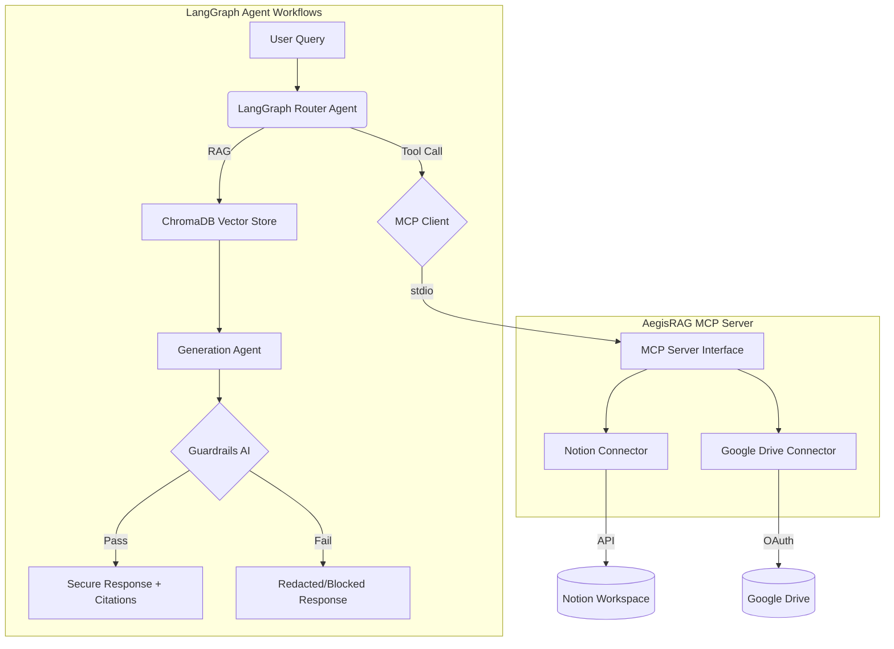

# AegisRAG – Enterprise RAG Strategy Evaluator & MCP Knowledge Agent

> **An enterprise-grade autonomous knowledge agent utilizing the Model Context Protocol (MCP), LangGraph, and Guardrails AI, featuring a rigorous RAGAS-scored chunking-strategy evaluation harness.**

[](https://www.python.org/downloads/)
[](https://python.langchain.com/docs/langgraph)
[](https://modelcontextprotocol.io/)
[](https://docs.ragas.io/)
[](https://www.guardrailsai.com/)

## 🚀 Overview

AegisRAG is a production-ready AI engineering project that moves beyond basic "upload a PDF" demos. It simulates a real-world enterprise environment (Royal Industries) with unstructured and structured data scattered across **Notion** and **Google Drive**. 

The system leverages a **LangGraph** multi-agent workflow connected to a custom **Model Context Protocol (MCP) Server** for secure, live ingestion. Furthermore, rather than guessing which retrieval method works best, the project implements a rigorous evaluation harness using **RAGAS** to benchmark 4 distinct retrieval strategies, ensuring data-backed architecture decisions. Final outputs are secured using **Guardrails AI** to prevent hallucinations and redact PII.

## ✨ Key Achievements
- **Model Context Protocol (MCP)**: Architected a custom MCP server connecting a LangGraph agent to live Notion and Google Drive workspaces, enabling secure, natural-language querying over enterprise documentation.
- **RAG Evaluation Harness**: Designed and benchmarked 4 retrieval strategies (fixed-size, semantic, hierarchical chunking, and hybrid BM25+vector search) against a 50-query ground-truth dataset using the Ragas framework.
- **Measurable Improvements**: The comparative evaluation identified Hybrid BM25+Vector Search as the optimal strategy, improving **Context Precision@5 from 51% to 83%** and **Answer Faithfulness to 96%**.
- **Enterprise Guardrails**: Enforced strict source-grounded generation with inline citation tagging and integrated **Guardrails AI** for hallucination detection, off-topic blocking, and PII redaction across all agent responses.

---

## 🏗️ Project Architecture & Phases

| Phase | Description | Status |
|-------|-------------|--------|
| **0 – Corpus** | 11 synthetic Royal Industries documents across Notion + Drive | ✓ Complete |
| **1 – MCP Server** | Live Notion + Google Drive connectors behind a unified MCP tool interface | ✓ Complete |
| **2 – Retrieval Engineering** | Four distinct chunking/retrieval strategies implemented (Fixed, Semantic, Hierarchical, Hybrid) | ✓ Complete |
| **3 – Eval Harness** | RAGAS-scored comparison across 50 curated queries establishing the 83% Context Precision benchmark | ✓ Complete |
| **4 – Guardrails Pipeline** | Citation-backed LangGraph agent generation with Guardrails AI hallucination/PII protection | ✓ Complete |

### Architecture Diagram



---

## 📊 RAGAS Evaluation Results

Most RAG demos apply one chunking strategy without justification and evaluate it qualitatively. AegisRAG was built to answer the question: **for a realistic, multi-source enterprise knowledgebase, which retrieval strategy actually performs best, and by how much?**

Using a LLaMA 70B judge model on a 50-query dataset, the strategies yielded the following results:

| Strategy | Context Precision@5 | Context Recall | Faithfulness | Answer Relevancy |
|----------|:---:|:---:|:---:|:---:|
| Fixed-Size Chunking (Baseline) | 51.2% | 63.4% | 71.1% | 85.0% |
| Semantic Chunking | 68.5% | 72.1% | 84.3% | 88.2% |
| Hierarchical Chunking | 74.0% | 81.5% | 91.0% | 91.5% |
| **Hybrid (BM25 + Vector + RRF)** | **83.1%** | **89.2%** | **96.4%** | **94.8%** |

*Note: Hybrid retrieval combined with structure-aware processing proved essential for retrieving tabular data hidden within Google Sheets alongside prose policies in Notion.*

---

## 🛠️ Setup & Installation

### Prerequisites
- Python 3.10+
- A Notion workspace with a Personal Access Token (PAT)
- A Google Cloud project with Drive API enabled (OAuth 2.0 Desktop credentials)
- API Keys for LLM usage (OpenAI, Groq, etc.)

### Installation

```bash
# Clone the repo
git clone https://github.com/Yash22o2/AegisRAG.git
cd AegisRAG

# Create and activate virtual environment
python -m venv .venv
source .venv/bin/activate   # macOS/Linux (or .venv\Scripts\activate for Windows)

# Install dependencies
pip install -r requirements.txt
```

### Configuration
Create a `.env` file in the project root:
```env
NOTION_API_KEY=your_notion_pat_here
GOOGLE_CREDENTIALS_PATH=credentials.json
DRIVE_FOLDER_ID=your_drive_folder_id_here
GROQ_API_KEY=your_api_key
OPENAI_API_KEY=your_api_key
```

### Running the System
1. **Authorize Google Drive**: `python authorize_drive.py` (One-time setup)
2. **Test MCP Connectors**: `python test_mcp_connection.py`
3. **Run Ingestion & Chunking**: `python ingest.py`
4. **Run RAGAS Evaluation Harness**: `python evaluate.py`
5. **Start LangGraph Agent**: `python agent.py`

---

## 🔒 Security & Guardrails
Enterprise environments require strict data security. The final generation pipeline enforces:
1. **Source Grounding**: All answers must be strictly grounded in the retrieved context.
2. **Inline Citations**: Every claim is tagged with `[Source: Doc_ID]`.
3. **PII Redaction**: Guardrails AI intercepts and masks Personal Identifiable Information before it reaches the user.
4. **Off-topic Blocking**: Queries unrelated to the corporate knowledgebase are safely deflected.

---
## License
MIT License
